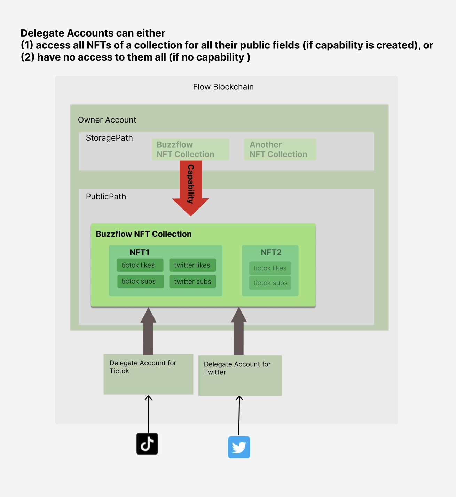

# AccessManager - A Granular Resource Access Control Solution 

## Problem Statement


Cadence provides both [capability-based access control](https://developers.flow.com/cadence/language/capability-based-access-control) and [access modifiers](https://developers.flow.com/cadence/language/access-control) to assist the resource access control. With proper implementation, these controls are sufficient to protect user resources in most of common transactions. One restriction however is: Once a capability is created,  **all** accounts will equally have **full** access to the related resource's **all** public declarations. 

Due to this restriction,  we faced some challenges when scaling the dapp Buzzflow. 

```
As the background, users can create AR videos with their NFT's 3D variants through Buzzflow's mobile app, then post these videos to the binded social platforms. Buzzflow will aggregate the metrics such as likes and followers through the se platform's APIs to update the NFT's storage, and eventually impact the NFT's rareness and market value. For security and scaling measures, an obvious architecture decision is to manage each social platform through an exclusive delegate account on Flow blockchain.
```




### Problem 1: How to limit delegate account's access to just designated fields of the NFTs

Ideally, we want the Tictok delegate account only be able to read and update the NFT's Tictok-related metrics, but never touch the Instagram or Twitter ones. With above mentioned restrictions, we know it's impossible to avoid intentional access. But there can be 


### Problem 2: How to control a particular NFT of a collection with a different access policy

We want the owner to be able to cut down Instgram delegate's access to just one NFT (say: due to malicious data), while keeping the Tictok/Twitter delegates, without impacting other NFTs from the same collection. 


this project proposes the interface contract **AccessManager** along with sample implementations and transaction tests, 
1.  


**AccessManager** is a part of Buzzflow submission for Flow's Hackathon. It's used in Buzzflow NFT smart contract 


## Design


## How to use this Playground

## Extra